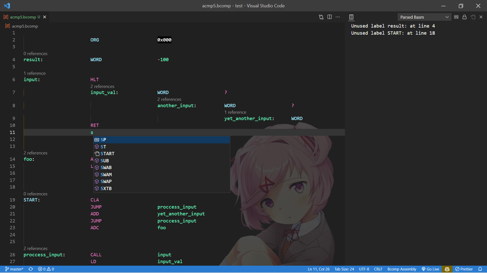
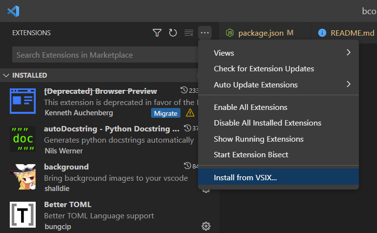

# Basic Computer Assembly



'Basic Computer Assembly' is a language server extension for Visual Studio Code for Basic Computer assembler files.
It provides support for:
- Assembler syntax highlighting.
- Completions: While you type completions are proposed based on the labels in your asm files.
- "Find all references": through a right mouse click in your assembler source file. It will come up with all found references in the other files.
- Command: bcomp-asm.find-labels-with-no-reference to find all labels that are not referenced. Useful to find dead code.
- Code Lens: Above symbols it shows the number of references. You can click it to get to the references.
- Labels definitions finding
<!-- - Hovering: When hovering over a symbol it shows the comments for the symbol.
- Outline view: View your labels (code, data, constants) in the outline view.
- Rename symbols. -->

It supports the `.bcomp` extension

## Installation

Install by extension package from [vsix extensiong](https://github.com/mamsdeveloper/bcomp-asm/tree/master/release).



## Syntax highlighting in Markdown code blocks

Assembler syntax highlighting can also be used within Markdown documents.
Just add ```bcomp``` to your code blocks.


## License and Acknowledgements

Basic Computer Assembly is licensed under the [MIT license](LICENSE.txt).

This extension made use of 4 other packages:
- [asm-code-lens](https://github.com/maziac/asm-code-lens)
- [find all references](https://github.com/gayanhewa/vscode-find-all-references) by gayanhewa, MIT License
- [grob](https://www.npmjs.com/package/grob) by jamiebuilds, MIT License
- [vscode-whats-new](https://github.com/alefragnani/vscode-whats-new) project from Alessandro Fragnani aka [alefragni](https://github.com/alefragnani), MIT License

Many thanks to the authors.


